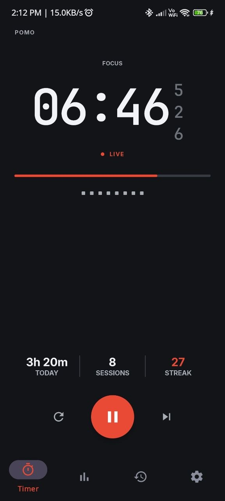
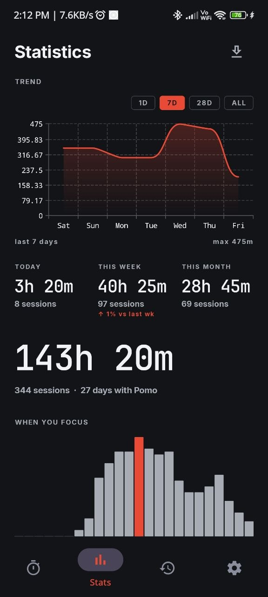
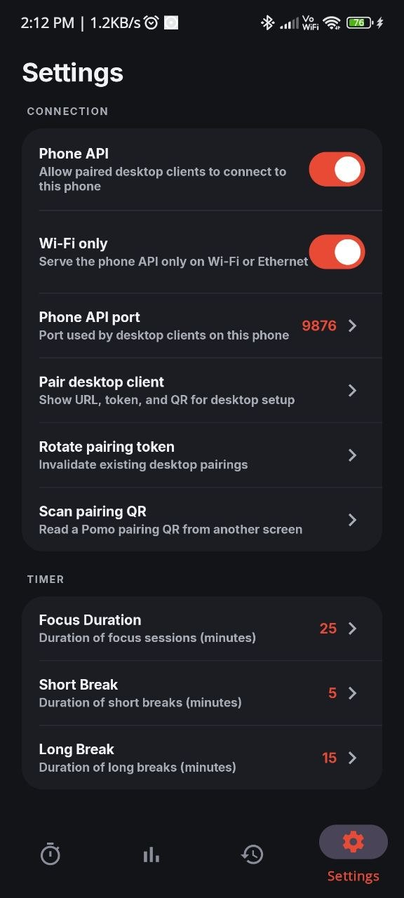

# Pomo

Pomo is a local-first Pomodoro timer for Android. It treats the phone as the
source of truth for timer state, settings, session history, notifications,
widgets, and the optional LAN desktop API.

The app is built like a focus instrument: large live time, dense stats, local
history, and direct controls. Desktop integrations are thin clients; they can
display or command the phone, but they do not own state.

<p>
  
  
  
</p>

## Features

- Phone-owned Pomodoro, short break, and long break timer state.
- Foreground service for resilient timing across app restarts.
- Room-backed completed session history and daily stats.
- Local-calendar history handling, including sessions that cross midnight.
- Timer, Stats, History, Settings, notification, and home-screen widget updates
  from the same phone-owned state.
- Optional local HTTP/WebSocket API for desktop display and control.
- Pairing-token protection for remote commands.
- Thin TypeScript desktop client for terminal, Waybar, QR, and service flows.

## Requirements

- JDK 17+
- Android SDK, preferably at `~/Android/Sdk`
- A connected Android device or emulator for install/run checks

Set `ANDROID_HOME` if your shell does not already provide it:

```bash
export ANDROID_HOME="$HOME/Android/Sdk"
```

## Build

Fast dev build:

```bash
./gradlew assembleDevDebug
```

Builder script, useful when this checkout needs to prepare its local SDK first:

```bash
./build_apk.sh
```

Debug APK:

```text
app/build/outputs/apk/dev/debug/app-dev-debug.apk
```

Production release build:

```bash
./gradlew assembleProdRelease
```

Production APK:

```text
app/build/outputs/apk/prod/release/app-prod-release-unsigned.apk
```

## Run

Install and launch the dev build:

```bash
adb install -r -g app/build/outputs/apk/dev/debug/app-dev-debug.apk
adb shell am start -n com.pomo/.MainActivity
```

Useful logs:

```bash
adb logcat -s PomodoroService PhoneServer
```

## Desktop Pairing

1. Open Pomo on the phone.
2. Open Settings.
3. Tap "Pair desktop client".
4. Use the displayed JSON payload or QR code in the desktop client.

```json
{
  "url": "http://<phone-ip>:9876",
  "token": "<pairing-token>"
}
```

The phone and desktop must be on the same network. The default API port is
`9876`, configurable in Settings.

## Desktop Client

The desktop client stores pairing details, sends commands to the phone API, and
keeps a best-effort stale cache for offline display.

```bash
npm --prefix desktop-client install
npm --prefix desktop-client run build
node desktop-client/dist/cli.js pair-json '{"url":"http://<phone-ip>:9876","token":"<pairing-token>"}'
node desktop-client/dist/cli.js status
node desktop-client/dist/cli.js toggle
node desktop-client/dist/cli.js qr
```

Background cache refresh service:

```bash
node desktop-client/dist/cli.js service install
node desktop-client/dist/cli.js service start
node desktop-client/dist/cli.js service status
```

See [docs/desktop-client.md](docs/desktop-client.md) for service paths, Waybar
output, QR commands, and failure behavior.

## Architecture

```text
app/src/main/java/com/pomo/
├── MainActivity.kt
├── service/       # PomodoroService, notifications, command receivers
├── timer/         # TimerState and OfflineTimer
├── db/            # Room database, sessions, daily stats
├── network/       # Embedded Ktor HTTP/WebSocket API
├── ui/            # Timer, Stats, History, Settings, About
├── util/          # Preferences, date logic, sound helpers
└── widget/        # Home-screen widget
```

State flow:

```text
User, notification, widget, or API command
        ↓
PomodoroService
        ↓
OfflineTimer + Room history
        ↓
State broadcast
        ↓
UI, notification, widget, and WebSocket clients
```

`PomodoroService` is the write boundary. Read-only status paths must not mutate
timer state. Room is the canonical history store. The embedded API exposes phone
state over the local network; it does not merge state from a desktop process.

## Documentation

- [docs/architecture.md](docs/architecture.md): deeper implementation map.
- [docs/protocol.md](docs/protocol.md): HTTP/WebSocket API, authentication, and
  payloads.
- [docs/desktop-client.md](docs/desktop-client.md): CLI, service, cache, and
  Waybar behavior.

## Validation

Run the unit and build checks:

```bash
./run_tests.sh
./gradlew assembleDevDebug
```

Manual checks worth doing on device:

- App launches without any laptop/server process.
- Start, pause, resume, skip, reset, and extend mutate phone state.
- Completed focus sessions appear in Today, Stats, History, notification, and
  widget.
- A session crossing midnight is split across local calendar days, with seconds
  rounded up to minutes per day segment.
- Restarting the app restores stopped, paused, and running timer state sensibly.
- `GET /api/status` rejects missing tokens and returns state with a valid token.
- `/ws` accepts a valid hello token and streams state updates.
- Desktop `status --waybar` shows fresh phone state when reachable and stale
  offline state when not.

## Releases

Releases are automated from `main`.

When a PR is merged, `.github/workflows/version-bump.yml` inspects the commit
messages in that push, bumps `versionCode` and `versionName` in
`app/build.gradle.kts`, commits the version bump back to `main`, and creates a
tag like `v1.12.0`.

The bump type follows Conventional Commits:

- `feat:` creates a minor release.
- `fix:` or `perf:` creates a patch release.
- `!` or `BREAKING CHANGE:` creates a major release.
- Anything else defaults to a patch release.

When a `v*` tag is pushed, `.github/workflows/release.yml` builds the dev debug
and unsigned prod release APKs, uploads them as workflow artifacts, and
publishes a GitHub Release with generated release notes.

## Notes

- Android app package: `com.pomo`
- Minimum SDK: 26
- Target SDK: 34
- Current app version in this checkout: `1.12.0`
- App-initiated cleartext traffic remains disabled; the embedded phone API is
  local-network HTTP protected by the pairing token.
- Pairing tokens are stored in dedicated non-backed-up shared preferences.
